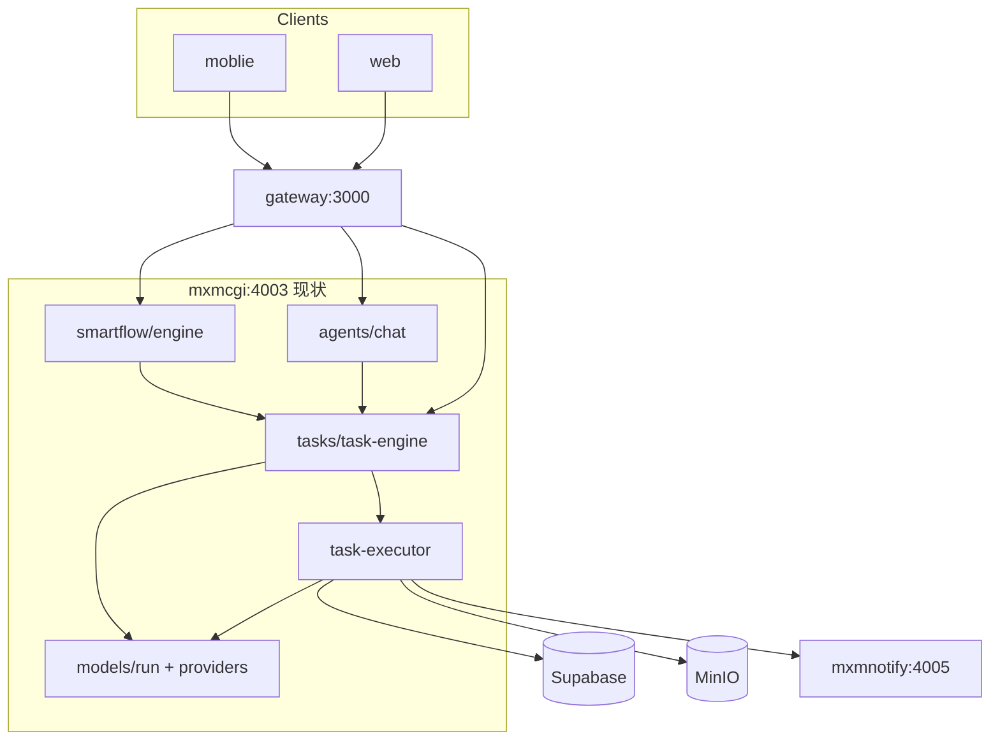
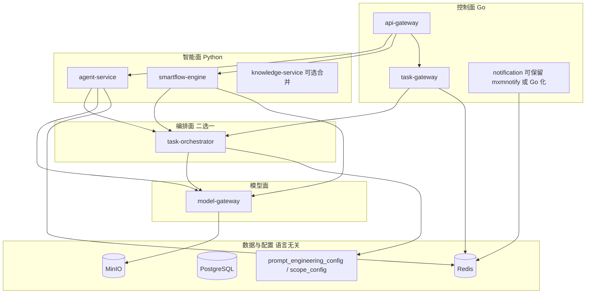
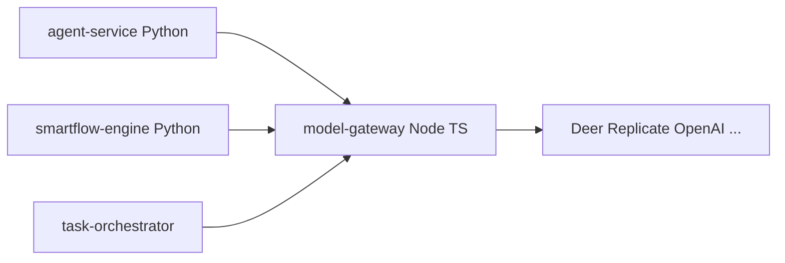
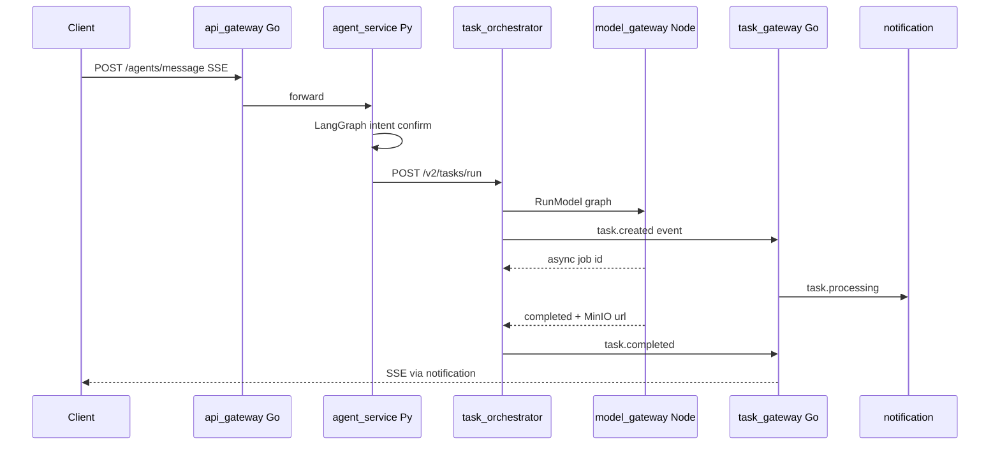

# SuperMXMai：Go + Python + LangChain 重构架构选型

## 1. 现状结论（重构起点）

当前三块能力**已全部落在 mxmcgi（:4003）**，并非独立 mxmagent：

| 模块 | 核心路径 | 本质 |
|------|----------|------|
| **业务生成（Task V2）** | [`mxmcgi/src/tasks/task-engine.ts`](mxmcgi/src/tasks/task-engine.ts) | 配置驱动编排：校验 → prelude → 模板渲染 → 模型路由 → 建 `cgi_tasks` → 异步执行 |
| **Smartflow** | [`mxmcgi/src/smartflow/core/engine/`](mxmcgi/src/smartflow/core/engine/) | 顺序图遍历 + 8 类 Executor；`business` 节点 HTTP 调 Task V2 |
| **Agent Chat** | [`mxmcgi/src/agents/chat.ts`](mxmcgi/src/agents/chat.ts) | 意图识别 → 多轮 confirm → `simulateTaskExecution` → Task V2；会话在**内存 Map** |

**关键判断**：三块里只有 **Agent Chat + Smartflow** 真正需要 LangChain/LangGraph 生态；**Task V2 业务生成**是「DB 配置 + 模板 + 计费 + 调模型」，用 LangChain 包裹反而增加不可观测性与调试成本。

---

## 2. 目标架构：按「控制面 / 智能面 / 模型面」切分

不建议按「写作服务、图服务、音频服务」过早拆成 6 个 Python 微服务（[docs/ARCHITECTURE_RESTRUCTURE.md](docs/ARCHITECTURE_RESTRUCTURE.md) 的 v1 略激进）。更稳妥的是 **3 层 + 1 个模型网关**：

### 2.1 Go 负责什么（高并发、低变化、强一致）

| 服务 | 职责 | 理由 |
|------|------|------|
| **api-gateway** | JWT、限流、路由、统一 request_id | 替换 [`gateway/src/routes/proxy.ts`](gateway/src/routes/proxy.ts) 中 1100+ 行混合逻辑 |
| **task-gateway** | 任务创建入口、状态聚合、SSE 推送 | 替代 Chat/Smartflow 内轮询 `taskExecutor`；对接 Redis Streams |
| **notification**（可选 Go 化） | SSE/WS 扇出 | 与 task-gateway 事件流耦合 |

**Go 不负责**：LLM prompt 拼装、意图识别、工作流图编译——这些变化快、依赖 Python AI 生态。

### 2.2 Python 负责什么（AI 密集、状态机、工具链）

| 服务 | 技术栈 | 对应现状 |
|------|--------|----------|
| **agent-service** | FastAPI + **LangGraph**（对话状态机）+ LangChain（Memory/RAG/Tool 适配） | [`agents/chat.ts`](mxmcgi/src/agents/chat.ts)、[`intent-detector.ts`](mxmcgi/src/agents/intent-detector.ts)、[`agents/memory/`](mxmcgi/src/agents/memory/) |
| **smartflow-engine** | **LangGraph** 为主（图编译、checkpoint、HITL） | [`smartflow/core/engine/`](mxmcgi/src/smartflow/core/engine/)、各 Executor |
| **knowledge-service**（可 Phase 2 独立） | LangChain retriever + pgvector | [`mxmcgi/src/knowledge/`](mxmcgi/src/knowledge/) |

mxmcgi 已引入 LangChain/LangGraph（[`mxmcgi/package.json`](mxmcgi/package.json) playground 脚本），但生产路径仍是手写 TS——重构时应**把 playground 能力产品化到独立 Python 服务**，而不是在 Node 里继续堆 `chat.ts`。

### 2.3 业务生成（Task V2）放哪里？

**推荐：编排留在「薄编排服务」，不引入 LangChain。**

- **方案 A（推荐，迁移成本最低）**：`task-orchestrator` 仍用 **TypeScript** 从 mxmcgi **抽出**（逻辑几乎原样：`task-definition` + `prompt-template` + `task-v2-prelude` + 计费钩子），只把 HTTP 入口迁到 Go task-gateway。
- **方案 B（中长期）**：`task-orchestrator` 用 **Go** 重写——适合你们希望编排层与 gateway 同栈；需完整移植模板引擎与 graph 参考图槽位校验（[`task-engine.ts`](mxmcgi/src/tasks/task-engine.ts) 内 graph 分支）。
- **不推荐**：用 LangChain `RunnableSequence` 实现 Task V2——配置化模板、固定 prelude、scope 路由都是确定性流水线，LangChain 无优势且难对齐 Admin bundle 契约（[`.cursor/skills/mxmai_graph_business_bundle/SKILL.md`](.cursor/skills/mxmai_graph_business_bundle/SKILL.md)）。

**配置平面保持 Supabase 单源**：`prompt_engineering_config`、`graph_scope_config`、`provider_models` 仍由 Admin/bundle 写入；各服务**只读** + 版本缓存（Redis）。

---

## 3. LangChain / LangGraph 如何选型（按模块）

| 模块 | 框架 | 用法 |
|------|------|------|
| **Agent Chat** | **LangGraph** 为主 | 将 `pendingNode` / `confirmStep` / `final` 建模为图节点；支持 interrupt/resume（对应 `POST /confirm`） |
| **Agent Memory** | **LangChain** Memory + 自研 Repository | 对接现有 `agent_memory` 表；recall 用 LangChain retriever 包装 pgvector |
| **意图识别** | LangChain structured output **或** 轻量分类器 | 替代 [`intent-detector.ts`](mxmcgi/src/agents/intent-detector.ts) 中关键词+LLM 双路径；节点列表仍来自 DB `extra.agent_rule` |
| **Smartflow** | **LangGraph** | DB 中 `smartflows` schema → `compile()` 为 `StateGraph`；节点类型映射见下表 |
| **Task V2** | **不用** LangChain | 保持模板渲染 + HTTP 调 model-gateway |
| **Tools（搜索/代码）** | LangChain Tools **或** 保留现有 HTTP 工具 | `deep_search` 等可逐步迁入 Python；`python_executor` 用沙箱服务（见下） |

**Smartflow 节点 → LangGraph 映射（与现 Executor 对齐）**：

| 现 TS Executor | LangGraph 实现 |
|----------------|----------------|
| start / end | 图入口/出口 |
| model (text/image/embedding) | 调用 model-gateway 的 tool node |
| condition | conditional_edges |
| loop | 子图 + `Send` API 或 recursion limit |
| variable | state reducer |
| tools | LangChain `@tool` + 自定义 ToolNode |
| business | 调用 task-orchestrator `POST /api/v2/tasks/run` |

**test/run 模式、video/sound 节点**：在 LangGraph 层用 `checkpointer` + `interrupt_before` 实现 HITL，比现 TS 引擎更易扩展。

---

## 4. Model Provider 层：Node vs Python vs Go（核心评估）

现状：[`mxmcgi/src/models/run.ts`](mxmcgi/src/models/run.ts) + 多 Provider（deer、replicate、ppio…），与 Task V2 / graph-task / writing-task 深度耦合。

### 4.1 三方案对比

| 维度 | **保持 Node（抽出 model-gateway）** | **迁 Python** | **迁 Go** |
|------|--------------------------------------|---------------|-----------|
| 重写成本 | **最低**（目录搬迁 + 独立进程） | 高（60+ 适配器） | 高（且无 AI SDK 生态） |
| LangChain 一体 | Agent 需 HTTP 调 Node | **文本/embedding 原生** | 割裂 |
| 图/视频/音频 | **已生产验证**（轮询、MinIO、计费钩子） | 可迁但收益有限 | 需重写轮询与错误分类 |
| 并发与连接池 | 够用 | 够用 | 略优，非瓶颈 |
| 运维复杂度 | 中（多一门语言已不可避免） | 中-高 | **高（三语言）** |
| 长期维护 | 两套 Provider（TS 媒体 + Py 文本） | 可逐步统一到 Py | **不推荐** |

### 4.2 明确建议（结论）

1. **短期（0–12 个月）：Model Provider 保持 Node.js**，从 mxmcgi 抽出独立服务 **`model-gateway`（仍 TypeScript）**  
   - 对外暴露稳定 RPC：`RunModel(scope, modelKey, params)` / `StreamText`  
   - Python 的 agent-service、smartflow-engine、task-orchestrator **只通过 gRPC/HTTP 调用**，不复制 Provider 逻辑  

2. **中期（按需）：仅将 `text` / `embedding` scope 迁到 Python**  
   - 使用 LangChain `init_chat_model` / provider 包统一 Deer、OpenAI、Anthropic  
   - **graph / video / audio / music 继续留 Node**，直到有明确性能或库依赖理由  

3. **不建议用 Go 承载 Model Provider**  
   - 除非做成**无业务语义的 HTTP 反向代理**（仍要在某处维护 provider 特化逻辑）  
   - Go 更适合 **task-gateway、api-gateway、事件扇出**，而非替换 `deerapi/provider.ts` 类代码  

---

## 5. 三模块落位总表

| 能力 | 目标服务 | 语言 | 框架 |
|------|----------|------|------|
| 业务生成 Task V2 | task-orchestrator | TS 抽出 → 可选 Go | 无 LangChain |
| Smartflow 设计/执行 | smartflow-engine | Python | LangGraph |
| Agent Chat | agent-service | Python | LangGraph + LangChain Memory |
| 模型调用 | model-gateway | **Node（推荐）** | 现有 ProviderFactory |
| 任务状态/SSE | task-gateway | Go | Redis Streams |
| 入口鉴权 | api-gateway | Go | gin/otel |
| 配置 Admin/bundle | 不变 | - | 写 Supabase，全服务只读 |

**数据流（目标态）**：

---

## 6. 与现有 [ARCHITECTURE_RESTRUCTURE.md](docs/ARCHITECTURE_RESTRUCTURE.md) 的差异（建议修正）

| 原提案 | 建议调整 |
|--------|----------|
| writing/graph/audio/video 四个 Python 微服务 | **先不拆**；用 task-orchestrator + model-gateway 按 scope 路由即可 |
| Agent 放在 writing-service | **独立 agent-service**，避免与批量写作任务抢资源 |
| Smartflow 纯 Python | **同意**，但 business 节点应调 task-orchestrator 而非直接调 graph-service |
| 全量 Provider 随 Python 迁移 | **否定**；Node model-gateway 为默认 |
| 全面 Redis Streams | **同意**，替代 outbox 轮询与 Chat 内 task 轮询 |

---

## 7. 若未来落地：推荐迁移顺序（Strangler Fig）

虽本次不编码，若后续实施建议顺序：

1. **契约先行**：OpenAPI/Protobuf 定义 `TaskRunRequest`、`ModelRunRequest`、`AgentSSEEvent`（对齐 [`agents/types.ts`](mxmcgi/src/agents/types.ts)）
2. **抽出 model-gateway（Node）** — 零业务逻辑变更，mxmcgi 改 HTTP 调用
3. **Go api-gateway + task-gateway** — 任务状态改事件驱动；mxmnotify 订阅 Redis
4. **Python agent-service** — 先迁 `handleGeneralChat` + Memory；再迁 confirm 状态机（LangGraph）
5. **Python smartflow-engine** — 与 TS 双跑对比结果（shadow mode）
6. **task-orchestrator 抽出** — Task V2 路径稳定后再考虑 Go 重写
7. **可选**：text/embedding Provider 迁 Python

**每个阶段保持**：Gateway 路径不变或版本化（`/api/v2`）；Supabase 配置表不变；moblie/web 仅改 baseURL（若有）。

---

## 8. 风险与刻意不做的事

- **不要** Big Bang 重写 Provider + Task V2 + Agent 同期上线  
- **不要** 在 Go 里实现 LangChain 等价物  
- **不要** 用 LangChain 重写 `unifiedTemplate` 渲染（保持 Jinja2/现 Mustache 风格引擎即可）  
- **必须** 将 Agent 会话从内存 Map 迁到 **Redis**（多实例与重启恢复）  
- **Python 沙箱**：Smartflow `code_executor` 用独立 **sandbox-worker**（gVisor/Firecracker），不要 `spawn python3`（现 [`toolsExecutor.ts`](mxmcgi/src/smartflow/core/executors/toolsExecutor.ts)）

---

## 9. 一句话总结

- **Go**：网关、任务状态、实时推送（控制面）  
- **Python + LangGraph**：Agent Chat、Smartflow（智能面）  
- **Node model-gateway**：Model Provider（模型面，短期最优）  
- **Task V2 编排**：薄服务、无 LangChain；配置仍在 Supabase  
- **LangChain**：仅用于 Memory/RAG/Tool 适配，不用于业务模板流水线  

此方案在「AI 生态收益」与「60+ Provider 重写成本」之间取平衡，且与当前代码结构（mxmcgi 单体、Task V2 为中枢）兼容度最高。
