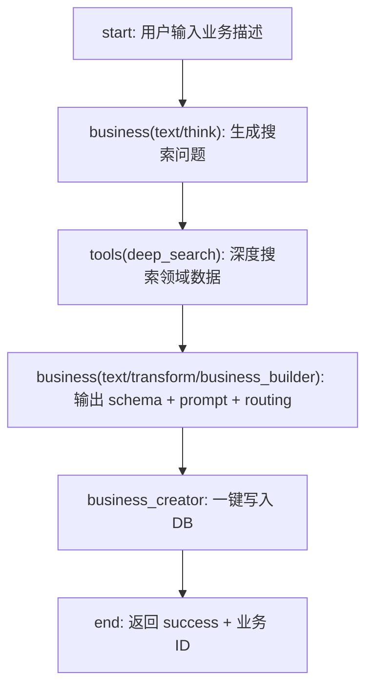

# Smartflow 一键生成图片业务方案（v2）

## 设计原则

- 最大化复用现有节点：`business`（调 Task V2）、`tools(deep_search)`、`end`
- 仅新增 **1 个节点类型**（`business_creator`）用于 DB 写入操作
- 新增 **2 条任务定义**（text/think + text/transform）走已有 Task V2 通道

---

## 整体 Flow



共 **6 个节点**，串行执行，每步职责清晰。

---

## 节点详情

### Node 1 -- start

用户输入 **1 个必填 + 3 个可选参数**：

- `business_description`（text，必填）：自由文本描述想做什么生图业务。示例："美甲商拍，需要手模参考图、美甲款式参考图、场景选择（美甲店/咖啡桌/大理石台面），支持九宫格输出"
- `graph_type`（text，默认 `photograph`）：photograph / design / painting
- `target_model`（text，默认 `gpt-image-2-all`）：生图模型 key
- `target_provider`（text，默认 `deer`）：provider

### Node 2 -- business: text/think/search_query_gen (新任务)

调用 Task V2：`scope=text, taskKey=think, subtype=search_query_gen`

**职责**：分析用户的业务描述，生成 3-5 条有针对性的搜索查询，用于后续深度搜索获取领域知识。

节点配置：
```typescript
{
  id: 'think_queries',
  type: 'business',
  name: '分析业务 & 生成搜索问题',
  business_scope: 'text',
  taskKey: 'think',
  subtype: 'search_query_gen',
  params: {
    topic: '{{input.business_description}}',
    context: '需要为 MXM AI 平台创建一个 {{input.graph_type}} 类型的图片生成业务',
  },
}
```

**任务 unifiedTemplate 核心**（新建 seed）：
```
你是 AI 图片生成平台的业务分析师。用户想创建一个新的生图业务：

${topic}

背景：${context}

请分析用户需求，输出 3-5 条搜索查询（JSON 数组），用于深度搜索获取以下领域知识：
1. 该业务类型的摄影/设计专业知识（构图、灯光、风格术语）
2. 目标用户的典型需求和使用场景
3. 同类竞品平台的功能设计参考
4. 相关的表单字段和配置选项参考

输出格式（纯 JSON 数组，不要 markdown）：
["query1", "query2", "query3", ...]
```

### Node 3 -- tools: deep_search

使用已有的 `deep_search` 工具节点，将 think 节点输出的查询依次搜索。

节点配置：
```typescript
{
  id: 'deep_search',
  type: 'tools',
  name: '深度搜索领域数据',
  tool_type: 'deep_search',
  tool_params: {
    query: '{{think_queries.output.text}}',
    depth: 'standard',
    numResults: 10,
  },
}
```

### Node 4 -- business: text/transform/business_builder (新任务)

调用 Task V2：`scope=text, taskKey=transform, subtype=business_builder`

**职责**：综合用户描述 + 搜索结果，输出完整的业务配置 JSON（formSchema + unifiedTemplate + graphRouting；`rules_i18n` 已废弃，勿产出规则正文）。

节点配置：
```typescript
{
  id: 'build_config',
  type: 'business',
  name: '生成业务配置',
  business_scope: 'text',
  taskKey: 'transform',
  subtype: 'business_builder',
  params: {
    prompt: '{{input.business_description}}',
    search_data: '{{deep_search.output.results}}',
    graph_type: '{{input.graph_type}}',
    target_model: '{{input.target_model}}',
    target_provider: '{{input.target_provider}}',
  },
}
```

**任务 unifiedTemplate 核心**（新建 seed，含 few-shot）：

prompt 模板包含：
1. 角色定义：你是 MXM AI 平台的业务配置架构师
2. 输入：用户描述 `${prompt}` + 搜索数据 `${search_data}` + 业务类型 `${graph_type}` + 模型 `${target_model}` + provider `${target_provider}`
3. few-shot 示例：完整的 `taobaonvzhuang-2` config JSON（约 300 行，来自 [graph-photograph-taobaonvzhuang-2.config.json](mxmcgi/src/tasks/examples/graph-photograph-taobaonvzhuang-2.config.json)）
4. 输出约束：必须输出**一个合法 JSON 对象**，结构如下：

```json
{
  "subtype": "string (kebab-case)",
  "display": { "taskLabel": "中文标签", "subtypeLabel": "subtype 说明" },
  "output_format_i18n": { "zh": "...", "en": "..." },
  "promptTextTaskKey": "text/format/gpt-image-2",
  "graphRouting": { "model": "gpt-image-2-all", "provider": "deer", "margin": 0.2 },
  "taskTemplate": {
    "formSchema": { ... },
    "prompt": { "unifiedTemplate": "..." }
  }
}
```

（入库时若 ORM 仍要求 `rules_i18n` 字段，可写 `{ "zh": "", "en": "" }`，**勿写规则正文**。）

5. formSchema 规范：参考图槽用 `x-ui-type: referenceImages`；枚举用 `x-ui-type: selection` + `enum` + `x-enum-labels`；必须包含 `prompt`、`aspect_ratio`、`output_grid`
6. unifiedTemplate 规范：使用 `${fieldName}` 占位符，每个 formSchema property 都要有对应占位

### Node 5 -- business_creator (新节点类型)

**这是唯一新增的节点类型**。

职责：接收 Node 4 输出的完整 config JSON，一键写入 DB 的 3 张表。

节点配置：
```typescript
{
  id: 'create_business',
  type: 'business_creator',
  name: '一键创建业务',
  config_source: '{{build_config.output.text}}',
}
```

执行器逻辑（`BusinessCreatorExecutor`）：
1. 解析上游 JSON -> `configData`
2. 写入 `prompt_engineering_config`（via `RepositoryFactory.createPromptEngineeringConfigRepository().upsert()`）
3. 写入 `graph_scope_config`（via `RepositoryFactory.createGraphScopeConfigRepository().upsertConfig()`）
4. 成功返回 `{ success: true, subtype, config_id }`，失败返回 `{ success: false, error }`

### Node 6 -- end

```typescript
{
  id: 'done',
  type: 'end',
  name: '完成',
  output_mapping: {
    success: '{{create_business.output.success}}',
    subtype: '{{create_business.output.subtype}}',
    config_id: '{{create_business.output.config_id}}',
  },
}
```

---

## 需要的代码变更

### 变更 1: 新增 `business_creator` 节点类型

**新建文件**: `mxmcgi/src/smartflow/core/executors/businessCreatorExecutor.ts`

核心逻辑参考现有 [seed-graph-taobaonvzhuang-2.ts](mxmcgi/src/scripts/seed-graph-taobaonvzhuang-2.ts) 的写入模式：

```typescript
export class BusinessCreatorExecutor extends BaseExecutor {
  async execute(node: SmartflowNode, context: ExecutionContext): Promise<ExecutorResult> {
    // 1. 从上游节点获取 config JSON（支持变量引用）
    const rawConfig = VariableResolver.resolve(node.config_source, context);
    const config = JSON.parse(rawConfig);

    // 2. 写入 prompt_engineering_config
    const promptRepo = RepositoryFactory.createPromptEngineeringConfigRepository();
    const saved = await promptRepo.upsert({
      scope: 'graph',
      type: config.graphType || 'photograph',
      subtype: config.subtype,
      rules_i18n: { zh: '', en: '' },
      output_format_i18n: config.output_format_i18n,
      extra: {
        promptTextTaskKey: config.promptTextTaskKey,
        display: config.display,
        taskTemplate: config.taskTemplate,
      },
      is_active: true,
    });

    // 3. 写入 graph_scope_config
    const graphRepo = RepositoryFactory.createGraphScopeConfigRepository();
    await graphRepo.upsertConfig({
      scope: 'graph',
      task_key: config.graphType || 'photograph',
      sub_type: config.subtype,
      model: config.graphRouting.model,
      provider: config.graphRouting.provider,
      enabled: true,
      margin: config.graphRouting.margin,
      charge_metric: config.graphRouting.charge_metric,
    });

    return this.createSuccessResult({
      success: true,
      subtype: config.subtype,
      config_id: saved.id,
    });
  }
}
```

**注册到 ExecutorFactory**（修改 [executors/index.ts](mxmcgi/src/smartflow/core/executors/index.ts)）：
```typescript
import { BusinessCreatorExecutor } from './businessCreatorExecutor';
// executors map 新增：
business_creator: new BusinessCreatorExecutor(),
```

**NodeType 新增**（修改 [types.ts](mxmcgi/src/smartflow/core/models/types.ts)）：
```typescript
export type NodeType =
  | 'start' | 'business' | 'model' | 'tools' | 'variable'
  | 'condition' | 'loop' | 'end'
  | 'business_creator';  // 新增
```

**SmartflowNode 新增字段**：
```typescript
// Business Creator 节点配置
config_source?: string;  // 上游配置 JSON 来源（变量引用）
```

### 变更 2: 新增 2 条任务定义（seed 脚本）

**新建文件**: `mxmcgi/src/scripts/seed-text-transform-business-builder.ts`

写入 2 条 `prompt_engineering_config`：

1. `scope=text, type=think, subtype=search_query_gen`
   - formSchema: `{ topic: string, context?: string }`
   - unifiedTemplate: 分析业务描述、输出搜索查询数组

2. `scope=text, type=transform, subtype=business_builder`
   - formSchema: `{ prompt: string, search_data?: string, graph_type: string, target_model: string, target_provider: string }`
   - unifiedTemplate: 含完整 few-shot 示例的业务配置生成模板

同时写入对应的 `text_scope_config` 路由（think + transform 绑定高智力模型如 deepseek-v3.2）。

### 变更 3: 新增 predefined flow

在 [predefined-flows.ts](mxmcgi/src/smartflow/core/predefined-flows.ts) 新增 `graphBusinessGeneratorFlow`，包含 6 个节点的完整定义。

---

## 数据流示意

```
用户输入: "美甲商拍，需要手模参考图..."
    |
text/think -> ["美甲商拍摄影构图技巧", "nail art photography setup", "美甲电商主图设计", ...]
    |
deep_search -> { results: [{title, url, snippet}, ...], count: 10 }
    |
text/transform/business_builder -> { subtype: "meijia-shangpai", formSchema: {...}, unifiedTemplate: "...", graphRouting: {...}, ... }
    |
business_creator -> prompt_engineering_config + graph_scope_config -> { success: true, config_id: "xxx" }
    |
end -> { success: true, subtype: "meijia-shangpai", config_id: "xxx" }
```

---

## 关键文件索引

- 新建 BusinessCreatorExecutor：`mxmcgi/src/smartflow/core/executors/businessCreatorExecutor.ts`
- 执行器注册：[executors/index.ts](mxmcgi/src/smartflow/core/executors/index.ts)
- 节点类型定义：[types.ts](mxmcgi/src/smartflow/core/models/types.ts)
- 预定义 flow：[predefined-flows.ts](mxmcgi/src/smartflow/core/predefined-flows.ts)
- 任务定义 seed 参考：[create-text-think-plan.ts](mxmcgi/src/scripts/create-text-think-plan.ts)
- Graph seed 参考：[seed-graph-taobaonvzhuang-2.ts](mxmcgi/src/scripts/seed-graph-taobaonvzhuang-2.ts)
- 业务配置 JSON 示例（few-shot 源）：[graph-photograph-taobaonvzhuang-2.config.json](mxmcgi/src/tasks/examples/graph-photograph-taobaonvzhuang-2.config.json)
- BusinessExecutor（复用）：[businessExecutor.ts](mxmcgi/src/smartflow/core/executors/businessExecutor.ts)
- Deep search（复用）：[toolsExecutor.ts](mxmcgi/src/smartflow/core/executors/toolsExecutor.ts) L322-349
