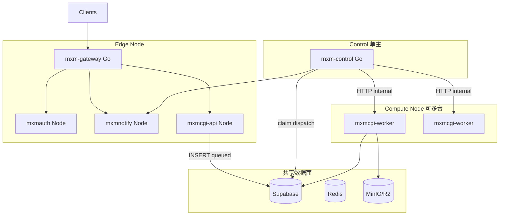
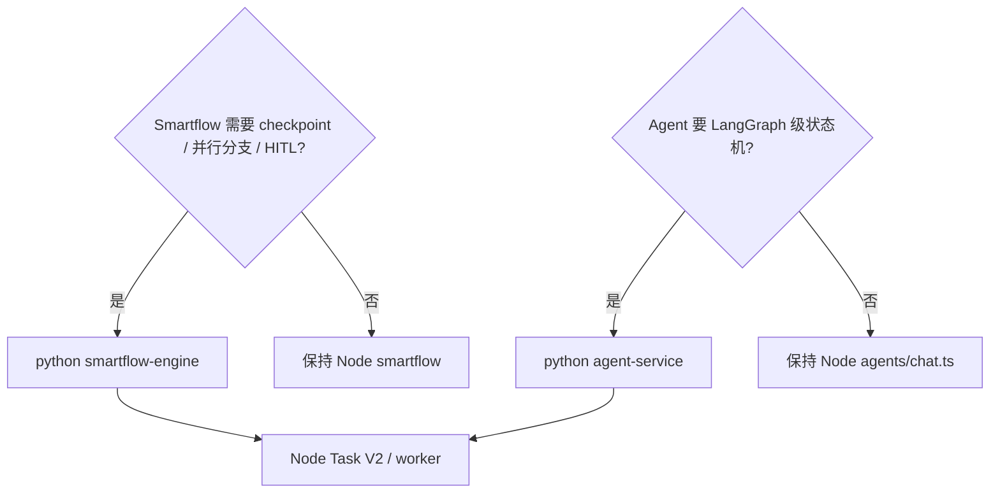

# SuperMXMai 模块拆分与语言选型规划（2C4G → 多机 → 4C8G）

## 前提（已确认）

- **首期生产**：单机 **2C4G**，可跑 `api` + `worker` 分离（不必再挤在单进程 mxmcgi）。
- **仓库**：继续 **[supermxmai monorepo](package.json)**，新增 **`go/`** 目录（不先走 migrate 新仓库）。
- **数据面**：Supabase + MinIO/R2 建议 **外置或独立容器**；2C4G 上避免同机跑完整 Postgres+MinIO+全微服务。

---

## 1. 目标：四种部署档位（同一套角色，不同 PROFILE）

| 档位 | 典型机器 | 进程策略 | 扩展方式 |
|------|----------|----------|----------|
| **P0** `single-2c2g` | 1×2C2G | 合并：`gateway` + `mxmcgi(all)` + auth + notify；**无 Go** 或仅 scheduler | 仅内测 |
| **P1** `single-2c4g` | 1×2C4G | **首期目标**：`gateway` + `mxmcgi-api` + `mxmcgi-worker` + `mxm-control` + auth + notify | 调并发上限 |
| **P2** `dual-2c4g` | 2×2C4G | M1：edge+control+api；M2：worker×N | **加 worker 机** |
| **P3** `scale-out` | N×4C8G + edge | edge/control 固定形态；worker 池水平扩；api 按需扩 | HPA/compose scale |

环境变量统一入口：`DEPLOY_PROFILE=single-2c4g|dual-2c4g|...`，与 `MXMCGI_ROLE`、`MXM_CONTROL_ENABLED` 组合。



---

## 2. 模块拆分总表（语言与职责）

### 2.1 Go（基础设施 / 并发 / 管道）

| 模块 | 目录建议 | 职责 | 首期 2C4G | 4C8G 扩展 |
|------|----------|------|-----------|-----------|
| **mxm-gateway** | `go/gateway/` | JWT、路由、限流、WS 代理；**无业务** | 1 进程 ~50MB | 多副本 behind LB |
| **mxm-control** | `go/control/` | **taskd**：claim `queued`、按类型/用户并发池、调度 worker；**scheduler**：outbox 投递 mxmnotify、task recovery | 1 进程（与 taskd 同二进制） | 1 active + Redis 选主 standby |
| （可选后期）**mxm-task-api** | `go/taskapi/` | 任务 SSE 读聚合、减 Agent 轮询 | P2+ | 与 gateway 合并或独立 |

**不放入 Go**：Provider、Task V2 模板、Billing/Usage 实现、Graph/Writing 逻辑（留在 Node worker）。

### 2.2 Node（业务与算力）

| 模块 | 现状路径 | 角色 | 首期 2C4G | 扩展 |
|------|----------|------|-----------|------|
| **mxmcgi-api** | [mxmcgi/src/index.ts](mxmcgi/src/index.ts) 拆入口 | Task V2、Agent、Smartflow、writing 路由；**只 createTask(queued)** | 1 进程 | 水平扩（无 executeTask） |
| **mxmcgi-worker** | 同包 `src/worker.ts`（新入口） | [task-executor.ts](mxmcgi/src/task/task-executor.ts)、Provider、[models/run.ts](mxmcgi/src/models/run.ts)、MinIO、计费 | 1 进程，**限制并发** | **加机器主要加此角色** |
| **mxmauth** | [mxmauth/](mxmauth/) | 认证 JWT | 1 | 1~2 |
| **mxmnotify** | [mxmnotify/](mxmnotify/) | SSE/WS、[task-events](mxmnotify/src/routes/task-events.ts) | 1 | 连接多时可扩 |
| **mxmpay** | [mxmpay/](mxmpay/) | 支付 | 1（低负载） | 按需 |
| **mxmdata** | [mxmdata/](mxmdata/) | 库，非独立进程 | - | - |
| **web / moblie** | 现有 | 前端 | 静态/CDN | - |

**壳层改动点（业务逻辑不动）**：

- [mxmcgi/src/tasks/task-engine.ts](mxmcgi/src/tasks/task-engine.ts)：`MXMCGI_ROLE=api` 时不调用 `taskExecutor.executeTask` fire-and-forget（约 503–514 行）。
- [mxmcgi/src/index.ts](mxmcgi/src/index.ts)：`ROLE=api` 不启动 outbox/recovery；`ROLE=worker` 不 listen 业务路由（仅 `/health` + `/internal/tasks/:id/execute`）。
- 新增 `MXMCGI_INTERNAL_TOKEN` 供 Go control 调 worker。

### 2.3 Python（分阶段，非首期必需）

| 模块 | 何时引入 | 职责 | 与 Node 关系 |
|------|----------|------|----------------|
| **agent-service** | **Phase 3+**（Agent 状态机/HITL 复杂化） | LangGraph confirm 流、Memory | 调 Node Task V2 / model-gateway |
| **smartflow-engine** | **Phase 3+**（并行分支、checkpoint） | Schema→LangGraph | `business` 节点 HTTP → task-orchestrator(Node) |
| **knowledge-worker** | 可选（批量 embedding） | 离线灌库 | 非在线路径 |

**首期 2C4G 结论：Python 不部署。** Agent/Smartflow 继续 [mxmcgi/src/agents/](mxmcgi/src/agents/) + [smartflow/](mxmcgi/src/smartflow/)；避免多语言 + 内存各占 200MB+。

---

## 3. 单机 2C4G 进程与资源预算（P1 首期）

| 进程 | 语言 | 建议内存上限 | 并发配置示例 |
|------|------|--------------|--------------|
| mxm-gateway | Go | 64–128MB | - |
| mxm-control | Go | 64–128MB | 全局 graph=2, video=1, text=4 |
| mxmcgi-api | Node | 256–384MB | 无 executeTask |
| mxmcgi-worker | Node | 512–1024MB | 实际生图占大头 |
| mxmauth | Node | 128MB | - |
| mxmnotify | Node | 128–256MB | - |
| mxmpay | Node | 128MB | 可合并 profile 暂不启 |
| Redis | - | 128–256MB | claim / 选主 / 可选 Agent session |
| **合计** | | ~1.5–2.8GB | 留 0.5GB+ 给 OS/buffer |

**同机不跑**：自托管 Postgres（用 Supabase 云）、完整 MinIO 集群（用 R2 或外置 MinIO）。

**关闭/迁移**：

- [mxmcgi/src/index.ts](mxmcgi/src/index.ts) 内 api/worker 角色下 **不再** 各启一套 [notification-outbox](mxmcgi/src/task/notification-outbox.ts) / [task-recovery](mxmcgi/src/task/task-recovery.ts)（交给 `mxm-control`）。

---

## 4. 演进：2×2C4G 与 4C8G

### 4.1 双机 2×2C4G（P2）

| 机器 | 部署 |
|------|------|
| **M1 edge** | gateway + mxm-control + mxmcgi-api + mxmauth + mxmnotify + Redis |
| **M2 compute** | mxmcgi-worker ×1–2 进程，`WORKER_ID` 区分；`MXMCGI_URL` 指向 M2 internal |

Go control 在 M1 通过 HTTP 调 M2 worker internal 执行；claim 仍走 Supabase（或 Redis 队列 Phase 2 优化）。

### 4.2 4C8G 节点（P3）

| 角色 | 建议 |
|------|------|
| **worker 机** | 每台 4C8G 跑 1–2 worker 进程，`WORKER_GRAPH_CONCURRENCY=3~4` |
| **api 机** | 2C4G 或 4C8G 均可，api 内存需求低于 worker |
| **edge** | 2C4G 足够 gateway+notify；或 4C8G 兼 api |
| **control** | 始终单主（4C8G 可跑 active+standby 两台，Redis leader） |

扩展顺序：**worker 节点 → api 节点 → gateway 副本**（与流量类型一致）。

---

## 5. Monorepo 目录结构（建议）

```text
supermxmai/
  go/
    gateway/          # cmd/gateway
    control/          # cmd/control (taskd + scheduler)
    pkg/
      taskclaim/      # DB SKIP LOCKED 或 Redis
      outbox/         # 移植 notification-outbox 语义
      recovery/       # 移植 task-recovery 语义
  mxmcgi/
    src/
      index.ts        # ROLE=api
      worker.ts       # ROLE=worker (新)
  gateway/            # 现有 Node gateway → Phase 2 退役或并行
  mxmauth/ mxmnotify/ mxmpay/ mxmdata/
  deploy/
    profiles/
      single-2c4g.compose.yml
      dual-2c4g.compose.yml
    env.example
```

根 [package.json](package.json) 增加：`dev:control`、`dev:gateway-go`（或 Makefile）。

---

## 6. 跨模块接口（稳定契约，便于 Go/Node 分工）

| 接口 | 方向 | 说明 |
|------|------|------|
| `POST /api/v2/tasks/run` | Client → api | 行为不变；仅落库 `queued` |
| `POST /internal/tasks/:id/execute` | control → worker | 内部鉴权；内部调用现有 `executeTask` |
| `task_event_outbox` 表 | worker → DB → control | worker 仍写 outbox（逻辑可保留在 Node） |
| `POST /task-events/status-changed` | control → mxmnotify | 与现 [notification-outbox](mxmcgi/src/task/notification-outbox.ts) 一致 |
| Gateway 路由 | 对外 | 与现 [proxy.ts](gateway/src/routes/proxy.ts) 路径对齐，Go 版用 YAML 配置 |

任务 claim SQL 方向（Go taskd）：

```sql
UPDATE cgi_tasks SET status='processing', worker_id=$1, started_at=now()
WHERE id IN (
  SELECT id FROM cgi_tasks
  WHERE status='queued' AND task_type = ANY($2)
  ORDER BY created_at
  FOR UPDATE SKIP LOCKED LIMIT $3
) RETURNING *;
```

（具体字段以 [mxmdata CGITask](mxmdata/src/models/CGITask.ts) 为准，必要时加 `worker_id` 列。）

---

## 7. 实施阶段（性价比排序）

### Phase 1 — 2C4G 可上线（4–6 周量级）

1. `MXMCGI_ROLE` + api/worker 入口拆分；api 不 `executeTask`。
2. `go/control`：outbox + recovery（先移植 TS 行为，单进程）。
3. `go/control` taskd：claim + 并发池 + 调 worker internal。
4. `go/gateway` 最小路由（或与 Node gateway 并行一周验证后切换）。
5. `deploy/profiles/single-2c4g.compose.yml` + 并发 env 文档。

### Phase 2 — 双机与可观测（2–4 周）

1. `dual-2c4g` compose；worker 无公网，仅 internal。
2. Redis 选主（control 单实例）。
3. 指标：队列深度、worker 并发、task 各阶段耗时；去掉 Agent DB 轮询（改 SSE，壳层）。

### Phase 3 — 4C8G 与 Python（按需）

1. worker 池水平扩展脚本/Ansible。
2. **若** Smartflow 要 checkpoint/HITL：独立 `python/smartflow-engine`（LangGraph），仍调 Node Task V2。
3. **若** Agent confirm 复杂化：独立 `python/agent-service`；2C4G 上不共存，需独立 4C8G 或云函数。

---

## 8. Python 决策树（后期）



**硬规则**：Python 服务 **不** 接管 Provider、不接管 `task-executor`、不替代 `mxm-control`。

---

## 9. 风险与规避

| 风险 | 规避 |
|------|------|
| 2C4G 内存爆 | worker 单独 cap；graph 并发≤2；Provider catalog 仅 worker/api 加载 |
| 双写通知 | 关闭 [ENABLE_LEGACY_GATEWAY_TASK_NOTIFICATION](gateway/src/routes/proxy.ts)；仅 control 投递 |
| control 多副本重复扫库 | 单实例或 Redis leader |
| Go/Node 两套 gateway | Phase 1 末切换 DNS，勿长期双跑 |
| Python 过早引入 | Phase 3 门控，资源够 4C8G 再加 |

---

## 10. 一句话总结

- **Go**：gateway + control（taskd/scheduler/outbox/recovery）— 全集群「管道与并发」。
- **Node**：mxmcgi-api + **mxmcgi-worker**（业务+Provider+计费）+ auth/notify/pay — 「算力与业务」。
- **Python**：Phase 3 可选，仅 Agent/Smartflow 编排深化，**首期 2C4G 不部署**。
- **扩容**：先加 **worker（4C8G）**，再加 api，最后 gateway；control 单主。
