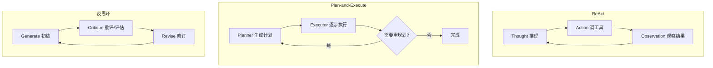

# AI Agent 编排模式：ReAct、Plan-and-Execute 与反思环

**面向有工程背景的读者** — 概念说明、技术实现与业内实践

---

## 目录

- [概述](#概述)
- [一、ReAct（Reasoning + Acting）](#一reactreasoning--acting)
- [二、Plan-and-Execute（先规划后执行）](#二plan-and-execute先规划后执行)
- [三、反思环（Reflection / Reflexion）](#三反思环reflection--reflexion)
- [四、三种模式对比与选型](#四三种模式对比与选型)
- [五、组合架构与生产实践](#五组合架构与生产实践)
- [六、生态与框架速查](#六生态与框架速查)
- [参考来源](#参考来源)

---

## 概述

在大模型应用从「单次问答」演进到「自主完成任务」的过程中，核心难题不再是「会不会写一段话」，而是：

1. **如何把推理与外部世界连接起来**（工具、数据库、API）；
2. **如何在多步任务中保持目标一致**（不跑偏、不重复、能恢复）；
3. **如何在生成质量上可控**（代码能跑、文案达标、方案可审计）。

业界围绕这三类问题，沉淀出三种经典 **Agent 编排模式**：

| 模式 | 英文常用名 | 核心循环 | 典型论文/出处 |
|------|------------|----------|----------------|
| ReAct | Reason + Act | Thought → Action → Observation → 重复 | [ReAct (Yao et al., 2022)](https://arxiv.org/abs/2210.03629) |
| Plan-and-Execute | Plan then Execute | Plan → Step₁…Stepₙ →（可选）Replan | LangChain / LangGraph 工程实践 |
| 反思环 | Reflection / Reflexion / Self-Critique | Generate → Critique → Revise → 重复 | [Reflexion (Shinn et al., 2023)](https://arxiv.org/abs/2303.11366) |

三者**不是互斥方案**，生产系统里常嵌套使用：顶层用 Plan 拆任务，某步内用 ReAct 查资料，对关键产出物跑反思环 + 自动化测试。



---

## 一、ReAct（Reasoning + Acting）

### 1.1 概念说明

**ReAct** 将大语言模型的 **链式推理（Chain-of-Thought）** 与 **对外行动（Tool Use）** 交织在同一循环里：

- **Thought（思考）**：解释当前状态、为何需要下一步、打算做什么；
- **Action（行动）**：调用一个工具（搜索、SQL、计算器、读文件、调 HTTP API 等）；
- **Observation（观察）**：工具返回的**真实、可验证**结果（不是模型编造）；
- 重复上述过程，直到模型认为信息足够，输出 **Final Answer**。

与「先想完所有步骤再一次性回答」相比，ReAct 的优势在于：**下一步决策强依赖上一步 Observation**，适合路径不确定、需要与外部环境反复交互的任务。

**典型适用场景：**

- 需要查实时或私有数据（订单、库存、内网文档）；
- 多工具协作（先搜索再算数再写邮件）；
- 调试型任务（读日志 → 定位 → 再查配置）。

**不适用或需慎用的场景：**

- 步骤极多且可预先分解（Plan 可能更省 token）；
- 工具延迟高、成本高，逐步 ReAct 会线性放大调用次数；
- 无可靠工具、Observation 噪声大时，容易陷入「空转」循环。

### 1.2 技术实现说明

#### 1.2.1 提示词范式（经典 ReAct 文本格式）

早期实现用**固定文本模板**约束模型输出，便于正则解析：

```text
Question: 北京今天天气如何？

Thought: 我需要查询实时天气，应使用天气工具。
Action: get_weather
Action Input: {"city": "北京"}
Observation: 北京：晴，25°C，湿度 40%

Thought: 已有足够信息，可以回答用户。
Final Answer: 北京今天晴，气温约 25°C。
```

实现要点：

| 组件 | 职责 |
|------|------|
| Prompt | 列出可用工具、输出格式、停止条件 |
| Parser | 从模型输出解析 `Action` / `Action Input` |
| Tool Runtime | 执行工具，将结果写回 `Observation` |
| Memory | 累积 Thought/Action/Observation 轨迹，作为下一轮上下文 |
| Stop Policy | 出现 `Final Answer`、达最大步数、或重复 Action 时终止 |

#### 1.2.2 现代实现：Function / Tool Calling

主流模型（GPT-4o、Claude、Gemini 等）支持 **structured tool calls**，由 API 返回 `tool_calls` 字段，不再依赖正则解析自然语言中的 `Action:` 行。

控制流等价于：

```text
while not done:
    response = llm(messages, tools=available_tools)
    if response.has_tool_calls:
        for call in response.tool_calls:
            observation = execute_tool(call.name, call.arguments)
            messages.append(tool_result)
    else:
        done = True  # 模型直接给出最终文本
```

**与经典文本 ReAct 的差异：**

- Thought 可能显式出现在 `reasoning` 字段，也可能被模型内化；
- 工程上更关注 **图状态（state）** 与 **条件边（conditional edges）**，而非字符串解析。

#### 1.2.3 状态机视角（LangGraph 等）

在图编排框架中，ReAct 常建模为两节点环：

```text
┌─────────┐     有 tool_calls      ┌─────────┐
│  agent  │ ─────────────────────► │  tools  │
│ (LLM)   │ ◄───────────────────── │ (执行)  │
└─────────┘   追加 Observation     └─────────┘
      │
      │ 无 tool_calls
      ▼
    [END]
```

**状态（State）** 通常至少包含：

- `messages`：对话与工具结果历史；
- 可选：`remaining_steps`、`error_count`、`token_budget`。

**常见生产增强：**

- **最大迭代次数**：防止无限调工具；
- **工具白名单与鉴权**：按用户/租户限制可调 API；
- **Observation 截断与摘要**：过长日志先 summarize 再进上下文；
- **Human-in-the-loop**：敏感 Action 需人工批准（LangGraph `interrupt`）。

### 1.3 代码示例

#### Python（LangGraph + Tool Calling）

```python
# 依赖: pip install langgraph langchain-openai langchain-core

from typing import Annotated, TypedDict
from langgraph.graph import StateGraph, END
from langgraph.prebuilt import ToolNode
from langgraph.graph.message import add_messages
from langchain_openai import ChatOpenAI
from langchain_core.tools import tool

@tool
def get_weather(city: str) -> str:
    """查询城市天气（示例）"""
    return f"{city}：晴，25°C"

tools = [get_weather]
llm = ChatOpenAI(model="gpt-4o-mini").bind_tools(tools)

class State(TypedDict):
    messages: Annotated[list, add_messages]

def agent(state: State):
    return {"messages": [llm.invoke(state["messages"])]}

def route(state: State):
    last = state["messages"][-1]
    return "tools" if getattr(last, "tool_calls", None) else END

graph = StateGraph(State)
graph.add_node("agent", agent)
graph.add_node("tools", ToolNode(tools))
graph.set_entry_point("agent")
graph.add_conditional_edges("agent", route, {"tools": "tools", END: END})
graph.add_edge("tools", "agent")
app = graph.compile()
```

#### Node.js（@langchain/langgraph）

```javascript
// 依赖: npm i @langchain/langgraph @langchain/openai @langchain/core zod

import { ChatOpenAI } from "@langchain/openai";
import { tool } from "@langchain/core/tools";
import { z } from "zod";
import { StateGraph, END, MessagesAnnotation } from "@langchain/langgraph";
import { ToolNode } from "@langchain/langgraph/prebuilt";

const getWeather = tool(
  async ({ city }) => `${city}：晴，25°C`,
  {
    name: "get_weather",
    description: "查询城市天气",
    schema: z.object({ city: z.string() }),
  }
);

const llm = new ChatOpenAI({ model: "gpt-4o-mini" }).bindTools([getWeather]);

async function agent(state) {
  return { messages: [await llm.invoke(state.messages)] };
}

function route(state) {
  const last = state.messages.at(-1);
  return last.tool_calls?.length ? "tools" : END;
}

const graph = new StateGraph(MessagesAnnotation)
  .addNode("agent", agent)
  .addNode("tools", new ToolNode([getWeather]))
  .addEdge("__start__", "agent")
  .addConditionalEdges("agent", route, ["tools", END])
  .addEdge("tools", "agent")
  .compile();
```

### 1.4 业内实践

| 实践 | 说明 |
|------|------|
| **OpenAI Assistants / Responses API** | 内置 tool loop，开发者提供 function schema，平台负责多轮调用 |
| **LangGraph `create_react_agent`** | 预置 ReAct 图，可插 middleware、checkpoint、人机协同 |
| **Anthropic Tool Use** | Claude 系列原生 tool_use 块，与 ReAct 循环同构 |
| **Cursor / Devin 类编码 Agent** | 读文件、改代码、跑终端 — 本质是多工具 ReAct + 长上下文 |
| **可观测性** | LangSmith、Arize Phoenix、OpenTelemetry 追踪每步 Thought/Tool/延迟/成本 |
| **评测** | 用固定 tool mock 测「是否选对工具、参数是否正确」，而非只测最终文案 |

**常见坑：**

1. **幻觉 Observation**：模型未真调工具却编造结果 — 必须用 runtime 回写，禁止模型自写 Observation。
2. **工具描述不清**：`description` 含糊导致错选工具 — 应写清输入 schema、何时用/何时不用。
3. **上下文爆炸**：多轮 Observation 塞满窗口 — 需摘要、滑动窗口或向量检索压缩历史。

---

## 二、Plan-and-Execute（先规划后执行）

### 2.1 概念说明

**Plan-and-Execute** 将任务拆成两个阶段（有时再加第三阶段 **Replan**）：

1. **Planner（规划器）**：根据用户目标生成**结构化计划**（步骤列表、DAG、或带依赖的任务图）；
2. **Executor（执行器）**：按 plan 逐步执行，每步可用不同 prompt、子 Agent 或工具集；
3. **Replanner（重规划器，可选）**：某步失败、环境变化或新信息出现时，**只更新剩余步骤**，避免从头再想。

与 ReAct 的对比：

| 维度 | ReAct | Plan-and-Execute |
|------|-------|------------------|
| 决策粒度 | 每步临时决定下一步 | 先全局分解再局部执行 |
| 对 LLM 调用 | 步数 ≈ 循环次数，常较多 | Planner 一次；Executor 按步 |
| 适应性 | 强依赖实时 Observation | 计划可能过时，需 Replan |
| 适合任务 | 路径未知、强交互 | 可分解、步骤相对独立 |

**典型适用场景：**

- 研究报告、竞品分析、迁移方案等多章节交付物；
- ETL / 数据管道、批量 API 编排；
- 软件需求 → 设计 → 实现 → 测试的流水线（每步不同角色）。

### 2.2 技术实现说明

#### 2.2.1 计划的数据结构

常见表示：

```json
[
  "检索近 7 天销售数据",
  "按区域聚合并生成图表",
  "撰写 300 字摘要邮件"
]
```

或带依赖的图：

```json
{
  "steps": [
    {"id": "1", "task": "拉取数据", "deps": []},
    {"id": "2", "task": "清洗", "deps": ["1"]},
    {"id": "3", "task": "写报告", "deps": ["2"]}
  ]
}
```

Planner 输出宜 **机器可解析**（JSON / YAML），便于校验、展示给用户确认、或并行调度无依赖步骤。

#### 2.2.2 执行器设计

每步 Executor 可配置：

| 策略 | 说明 |
|------|------|
| **单 LLM 调用** | 简单步骤，一步 prompt 完成 |
| **子 ReAct Agent** | 该步需要查资料、调多工具 |
| **确定性代码** | 能脚本化的步骤不用 LLM（算数、格式转换） |
| **专用模型** | Planner 用大模型，Executor 用小模型降本 |

**上下文传递**：第 *i* 步应接收 `{goal, plan, step_i, outputs[0..i-1]}`，避免 Executor 丢失全局意图。

#### 2.2.3 Replan 触发条件

- 某步返回错误或空结果；
- 用户中途修改目标；
- Observation 与计划假设矛盾（例如「数据库无该表」）；
- 剩余预算（token/时间）不足，需收缩计划。

Replan 输入：`{original_goal, completed_steps, failed_step, error, remaining_budget}`  
输出：**新的剩余步骤列表**（不必重跑已完成步骤）。

#### 2.2.4 架构示意

```text
User Goal
    │
    ▼
┌──────────┐
│ Planner  │──► plan: [S1, S2, S3, ...]
└──────────┘
    │
    ▼
┌──────────┐     失败/新信息
│ Executor │◄──────────────┐
│  (Si)    │               │
└──────────┘               │
    │                      │
    ▼                      │
  Si 完成? ──否────────────┤
    │是                    │
    ▼                      │
 还有 Si+1? ──是──► 下一步 ─┘
    │否
    ▼
  Final Output
```

### 2.3 代码示例（简化两阶段 + 可选 Replan）

#### Python

```python
import json
from langchain_openai import ChatOpenAI
from langchain_core.prompts import ChatPromptTemplate

llm = ChatOpenAI(model="gpt-4o-mini")

plan_prompt = ChatPromptTemplate.from_messages([
    ("system", "将目标拆成 3-6 个可执行步骤。只输出 JSON 字符串数组，不要 markdown。"),
    ("user", "{goal}"),
])

exec_prompt = ChatPromptTemplate.from_messages([
    ("system", "你是执行器。只完成当前步骤，输出简洁结果。"),
    ("user", "总目标：{goal}\n当前步骤：{step}\n已完成摘要：{summary}"),
])

replan_prompt = ChatPromptTemplate.from_messages([
    ("system", "根据失败信息，输出修订后的「剩余步骤」JSON 数组。"),
    ("user", "目标：{goal}\n已完成：{done}\n失败步骤：{failed}\n错误：{error}"),
])

def run_plan_and_execute(goal: str) -> str:
    plan_msg = llm.invoke(plan_prompt.format_messages(goal=goal))
    steps = json.loads(plan_msg.content)
    summary = ""
    done = []

    i = 0
    while i < len(steps):
        step = steps[i]
        try:
            out = llm.invoke(exec_prompt.format_messages(
                goal=goal, step=step, summary=summary or "（无）"
            ))
            summary += f"\n- {step}: {out.content[:200]}"
            done.append(step)
            i += 1
        except Exception as e:
            replan = llm.invoke(replan_prompt.format_messages(
                goal=goal, done=done, failed=step, error=str(e)
            ))
            steps = done + json.loads(replan.content)
            i = len(done)

    return summary
```

#### Node.js

```javascript
import { ChatOpenAI } from "@langchain/openai";
import { ChatPromptTemplate } from "@langchain/core/prompts";

const llm = new ChatOpenAI({ model: "gpt-4o-mini" });

const planPrompt = ChatPromptTemplate.fromMessages([
  ["system", "拆成 3-6 步，只输出 JSON 数组"],
  ["user", "{goal}"],
]);

const execPrompt = ChatPromptTemplate.fromMessages([
  ["system", "只完成当前步骤"],
  ["user", "目标：{goal}\n步骤：{step}\n摘要：{summary}"],
]);

async function run(goal) {
  const plan = await planPrompt.pipe(llm).invoke({ goal });
  const steps = JSON.parse(plan.content);
  let summary = "";
  for (const step of steps) {
    const out = await execPrompt.pipe(llm).invoke({
      goal,
      step,
      summary: summary || "（无）",
    });
    summary += `\n- ${step}: ${out.content.slice(0, 200)}`;
  }
  return summary;
}
```

生产级实现可参考 LangGraph 官方教程：[Plan-and-Execute](https://langchain-ai.github.io/langgraph/tutorials/plan-and-execute/plan-and-execute/)。

### 2.4 业内实践

| 实践 | 说明 |
|------|------|
| **BabyAGI / AutoGPT 早期思路** | 任务队列 + 优先级，可视为 Plan 的变体（易漂移，需约束） |
| **LangGraph Plan-and-Execute** | Planner / Executor / Replanner 三节点，社区模板成熟 |
| **OpenAI Deep Research** | 多轮子问题分解 + 检索 + 综合，宏观上接近 Plan-Execute-Replan |
| **CI/CD 与 AI 结合** | Plan = pipeline stages；Execute = 脚本/容器；失败则 replan 跳过或改参 |
| **人在回路** | Plan 生成后先给用户勾选/编辑再执行，降低胡编步骤风险 |
| **并行化** | 无依赖步骤用 asyncio / worker 池并行，缩短总延迟 |

**常见坑：**

1. **计划过于空洞**（「分析一下」）— Planner prompt 要要求可验证、可执行的步骤。
2. **计划与现实脱节** — 必须在 Execute 后接 Replan 或 ReAct 子循环。
3. **不缓存计划** — 相同类任务应复用模板计划 + 少量 LLM 微调。

---

## 三、反思环（Reflection / Reflexion）

### 3.1 概念说明

**反思环**（也称 Self-Critique、Reflexion）在「一次生成」之外增加 **评估与修订** 闭环：

1. **Generate（生成）**：产出初稿（代码、文案、计划、SQL 等）；
2. **Critique（批评/评估）**：指出错误、遗漏、风格问题；或给出分数 / rubric；
3. **Revise（修订）**：根据批评修改；
4. 重复直到满足停止条件（质量达标、Critique 返回 PASS、或达最大轮数）。

与 ReAct 的区别：反思环的 Observation 常来自 **对自身输出的评判**（或外部验证器），目标是 **提高单次交付物质量**，而非选择下一个工具。

与 Plan-and-Execute 的区别：反思环通常 **不重新拆全局计划**，而是 **在同一 artefact 上迭代打磨**。

**典型适用场景：**

- 代码生成 + 单元测试 / linter；
- 营销文案 + 品牌规范检查；
- SQL / 查询优化 + EXPLAIN 验证；
- 数学证明、法律文书等需要自检的领域。

### 3.2 技术实现说明

#### 3.2.1 角色划分

| 方式 | 优点 | 缺点 |
|------|------|------|
| **同一模型不同 system prompt** | 简单、成本低 | 自我偏袒，Critique 不够狠 |
| **双模型（生成器 + 批评器）** | 批评更独立 | 成本更高 |
| **规则/程序 Critique** | 客观、可重复 | 覆盖有限 |
| **混合** | 先规则后 LLM | 工程复杂度中等 |

Reflexion 论文强调：将 **环境反馈**（测试失败栈、游戏得分）作为 Critique 的一部分，比纯 LLM 自评更可靠。

#### 3.2.2 停止条件

- Critique 文本包含 `PASS` / `APPROVED`；
- 评分 ≥ 阈值（如 0.9）；
- 连续两轮修订无实质变化（早停）；
- 达到 `max_rounds`；
- 外部验证通过（`pytest` 全绿、`npm test` 通过）。

#### 3.2.3 与测试驱动的结合（推荐生产形态）

```text
Generate(code)
    │
    ▼
Run tests / linter  ──失败──► Critique = 测试输出 + LLM 解读
    │                              │
    │通过                          ▼
    ▼                          Revise(code)
 Final code ◄──────────────────────┘
```

这比「纯 LLM 互评」更接近软件工程里的 **TDD + Code Review**。

#### 3.2.4 架构示意

```text
        ┌─────────────┐
        │  Generate   │
        └──────┬──────┘
               ▼
        ┌─────────────┐     PASS
        │  Critique   │────────────► 输出
        └──────┬──────┘
               │ FAIL / 改进建议
               ▼
        ┌─────────────┐
        │   Revise    │
        └──────┬──────┘
               │
               └──► (下一轮 Generate 或 Revise)
```

### 3.3 代码示例

#### Python（LLM Critique + PASS 停止）

```python
from langchain_openai import ChatOpenAI
from langchain_core.prompts import ChatPromptTemplate

llm = ChatOpenAI(model="gpt-4o-mini")
task = "用 Python 写 fib(n)，n<0 时抛 ValueError"

generate_p = ChatPromptTemplate.from_messages([
    ("system", "只输出代码，不要解释"),
    ("user", "{task}"),
])
critique_p = ChatPromptTemplate.from_messages([
    ("system", "你是审查员。列 bug 与边界问题。若可合并则写 PASS。"),
    ("user", "任务：{task}\n代码：\n{code}"),
])
revise_p = ChatPromptTemplate.from_messages([
    ("system", "根据审查修订，只输出代码"),
    ("user", "任务：{task}\n代码：\n{code}\n审查：\n{critique}"),
])

code = llm.invoke(generate_p.format_messages(task=task)).content

for _ in range(3):
    review = llm.invoke(critique_p.format_messages(task=task, code=code)).content
    if "PASS" in review:
        break
    code = llm.invoke(revise_p.format_messages(
        task=task, code=code, critique=review
    )).content
```

#### Python（反思 + 真实测试反馈）

```python
import subprocess
import tempfile
import os

def run_pytest(code: str) -> tuple[bool, str]:
  with tempfile.TemporaryDirectory() as d:
    path = os.path.join(d, "solution.py")
    test_path = os.path.join(d, "test_solution.py")
    open(path, "w").write(code)
    open(test_path, "w").write("""
import pytest
from solution import fib
def test_fib():
    assert fib(5) == 5
def test_negative():
    with pytest.raises(ValueError):
        fib(-1)
""")
    r = subprocess.run(
      ["pytest", test_path, "-q"],
      capture_output=True, text=True, cwd=d
    )
    return r.returncode == 0, r.stdout + r.stderr
```

将 `run_pytest` 的输出作为 `critique` 喂给 `revise_p`，即 **Reflexion + 工具验证**。

#### Node.js（同构 LLM 三环）

```javascript
import { ChatOpenAI } from "@langchain/openai";
import { ChatPromptTemplate } from "@langchain/core/prompts";

const llm = new ChatOpenAI({ model: "gpt-4o-mini" });
const task = "用 JS 写 fib(n)，n<0 抛 Error";

const generate = ChatPromptTemplate.fromMessages([
  ["system", "只输出代码"],
  ["user", "{task}"],
]);
const critique = ChatPromptTemplate.fromMessages([
  ["system", "列问题；完美则 PASS"],
  ["user", "任务：{task}\n代码：\n{code}"],
]);
const revise = ChatPromptTemplate.fromMessages([
  ["system", "按审查修订，只输出代码"],
  ["user", "任务：{task}\n代码：\n{code}\n审查：\n{critique}"],
]);

let code = (await generate.pipe(llm).invoke({ task })).content;
for (let i = 0; i < 3; i++) {
  const review = (await critique.pipe(llm).invoke({ task, code })).content;
  if (review.includes("PASS")) break;
  code = (await revise.pipe(llm).invoke({ task, code, critique: review })).content;
}
```

### 3.4 业内实践

| 实践 | 说明 |
|------|------|
| **Reflexion 论文** | 用语言反馈 + 环境奖励改进决策，用于 AlfWorld、编程等 |
| **Self-Refine / CRITIC** | 多轮自我 refine，与反思环同族 |
| **GitHub Copilot / Cursor** | 生成后跑测试、根据错误再改 — 产品化反思 |
| **LLM-as-Judge** | 用强模型评弱模型输出，用于 RLHF、RAG 评测、反思中的 Critique |
| **Constitutional AI** | 原则驱动的批评与修订，可视为带规范约束的反思环 |
| **LangSmith Evaluators** | 自定义 rubric 自动打分，未达标触发重试 |

**常见坑：**

1. **Critique 太软** — 模型互相「客气」，需硬性停止条件或外部测试。
2. **无限修订** — 必须 `max_rounds` + 早停。
3. **修订时丢失约束** — Revise prompt 要重复完整 task 与硬性格式要求。

---

## 四、三种模式对比与选型

### 4.1 对比总表

| 维度 | ReAct | Plan-and-Execute | 反思环 |
|------|-------|------------------|--------|
| 主要优化目标 | 正确交互、获取事实 | 任务分解、全局一致 | 输出质量、可验证性 |
| 循环驱动 | 工具 Observation | 计划步骤 | Critique / 测试结果 |
| Token 成本 | 中高（步数相关） | 中（可小模型执行） | 高（多轮全文） |
| 延迟 | 工具 RTT 叠加 | 可并行步骤 | 多轮生成 |
| 可解释性 | 逐步轨迹清晰 | 计划可读 | 修订历史可审计 |
| 失败模式 | 错工具、死循环 | 计划脱离现实 | 自嗨式 PASS |

### 4.2 选型决策树（简版）

```text
需要调用外部工具/数据？
├─ 是，且下一步高度依赖上一步结果 → ReAct（或该步内 ReAct）
└─ 否 → 是否多步、可预先分解？
    ├─ 是 → Plan-and-Execute（关键步内可嵌 ReAct）
    └─ 否 → 是否对质量/格式要求极高？
        ├─ 是 → 反思环（优先接自动化验证）
        └─ 否 → 单次 LLM 调用即可
```

### 4.3 组合示例

**场景：根据内部 Wiki 写 API 设计文档并生成初版代码**

```text
1. Plan-and-Execute
   - S1: 检索 Wiki 相关页面（子 Agent: ReAct + search_tool）
   - S2: 输出 OpenAPI 草案
   - S3: 生成 FastAPI 骨架
   - S4: 生成 pytest

2. 对 S3、S4 artifacts 跑反思环
   - Critique = pytest + mypy 输出
   - Revise 直至测试通过或达 3 轮

3. 全局 Replan（若 Wiki 无权限）
   - 缩小范围或提示用户补充文档
```

---

## 五、组合架构与生产实践

### 5.1 横切能力（三种模式共用）

| 能力 | 说明 |
|------|------|
| **Checkpoint / 持久化状态** | LangGraph checkpointer，支持断点续跑、审计 |
| **流式输出** | 向用户展示 Plan / 当前步骤 / 修订进度 |
| **预算控制** | token、美元、墙钟时间上限，触发优雅降级 |
| **幂等与重试** | 工具调用 idempotency key，避免重复下单 |
| **权限** | RBAC 限制工具与数据范围 |
| **评测集** | 回归测试 Agent 轨迹，而非只看最终一句 |

### 5.2 观测与调试

建议为每次运行记录：

- `run_id`、`pattern`（react / plan / reflect）
- 每步：`latency_ms`、`input_tokens`、`output_tokens`、`tool_name`
- 最终：`success`、`user_rating`、`automated_score`

便于分析：是 Planner 常漏步，还是 ReAct 常选错工具，还是反思环在空转。

### 5.3 成本优化

- Planner / Critique 用大模型；Executor / 简单 Revise 用小模型；
- 计划模板化，仅对变量部分调用 LLM；
- 缓存相同工具的 Observation（注意 TTL）；
- 反思环优先 **程序 Critique**，LLM 只解读失败原因。

### 5.4 安全

- 工具参数校验（schema、SQL 参数化）；
- 输出过滤（PII、密钥泄露）；
- 高风险 Action 人工批准；
- 反思环不能把测试环境凭证写进生成代码。

---

## 六、生态与框架速查

### Python

| 框架 / 库 | 相关能力 |
|-----------|----------|
| [LangGraph](https://github.com/langchain-ai/langgraph) | 图状态机、ReAct、Plan-and-Execute 教程、checkpoint |
| [LangChain](https://github.com/langchain-ai/langchain) | Agents、tools、prompts |
| [OpenAI Agents SDK](https://github.com/openai/openai-agents-python) | 多 Agent、handoff、内置 tool loop |
| [Pydantic AI](https://github.com/pydantic/pydantic-ai) | 类型安全 tool、依赖注入 |
| [AutoGen](https://github.com/microsoft/autogen) | 多 Agent 对话、可嵌反思 |
| [DSPy](https://github.com/stanfordnlp/dspy) | 程序化优化 prompt / 管道 |

### Node.js / TypeScript

| 框架 / 库 | 相关能力 |
|-----------|----------|
| [@langchain/langgraph](https://www.npmjs.com/package/@langchain/langgraph) | 与 Python 同构的图编排 |
| [Vercel AI SDK](https://sdk.vercel.ai/) | 流式、tool calling，需自写循环或接 LangGraph |
| [Mastra](https://mastra.ai/) | TS Agent 框架、workflow |
| [OpenAI Node SDK](https://github.com/openai/openai-node) | `chat.completions` + tools 手动环 |

### 评测与可观测

- [LangSmith](https://smith.langchain.com/) —  trace、dataset、evaluator  
- [Arize Phoenix](https://github.com/Arize-ai/phoenix) — 开源 trace / eval  
- [Braintrust](https://www.braintrust.dev/) — 实验与回归  

---

## 参考来源

### 论文与文章

- Yao, S. et al. (2022). *ReAct: Synergizing Reasoning and Acting in Language Models*. https://arxiv.org/abs/2210.03629  
- Shinn, N. et al. (2023). *Reflexion: Language Agents with Verbal Reinforcement Learning*. https://arxiv.org/abs/2303.11366  
- Madaan, A. et al. (2023). *Self-Refine: Iterative Refinement with Self-Feedback*. https://arxiv.org/abs/2303.17651  
- Gou, Z. et al. (2023). *CRITIC: Large Language Models Can Self-Correct with Tool-Interactive Critiquing*. https://arxiv.org/abs/2305.11738  

### 官方教程

- LangGraph Plan-and-Execute: https://langchain-ai.github.io/langgraph/tutorials/plan-and-execute/plan-and-execute/  
- LangGraph Agent 概念: https://langchain-ai.github.io/langgraph/concepts/agentic_concepts/  

### 工程博客（选读）

- LangChain Blog — Agent / LangGraph 系列  
- OpenAI — Function calling、Assistants、Agents 文档  

---

*文档版本：2026-05 · 可与 `pylearn/phase4-data-ai/tutorial.md` 配套阅读*
