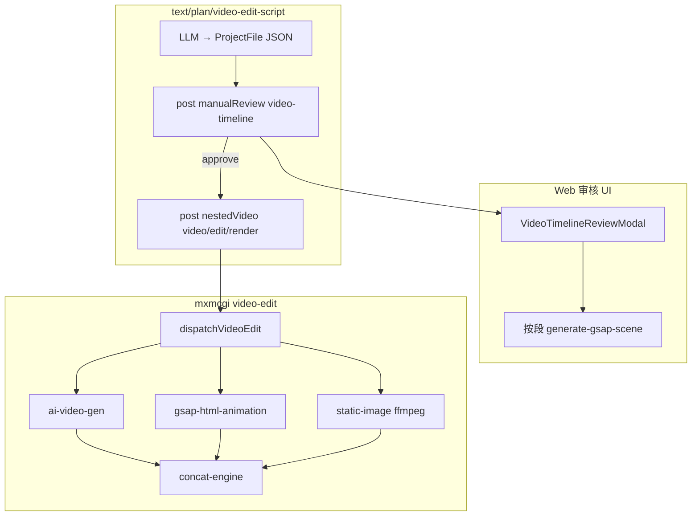

# supermxmai 视频剪辑集成 — 总体设计 v3

> **当前阶段**：视频剪辑 MVP 闭环已实现（text → 审核 → render）
> **详细验收**：见 [01-video-edit-mvp.md](./01-video-edit-mvp.md)

---

## 1. 端到端架构

## 2. 数据契约

- **OpenReel ProjectFile v1.0.0**：`@mxmai/mxm-editor-core`
- **supermxmai 扩展**：`clip.metadata.mxm*`（`mxmcgi/src/core/video-edit/types.ts`）
- **两种 mxmRenderMode**：`ai-video-gen` | `static-image`（`gsap-html-animation` 遗留，构建时归并）

## 3. 两种 mxmRenderMode + OpenReel overlay

| 模式 | 说明 |
|------|------|
| `static-image` | 素材引入（图库/视频库/手动选图） |
| `ai-video-gen` | AI 生成（文生/图生/参考生视频） |

文字动效、转场、图形叠加走 OpenReel `project.textClips` / `track.transitions`（不再使用 `gsap-html-animation` 整段块）。

## 4. 已完成模块

| 区域 | 路径 | 状态 |
|------|------|------|
| 编辑器核心 | `mxm-editor-core/` | ✅ workspace 包 |
| 类型 + dispatcher | `mxmcgi/src/core/video-edit/` | ✅ |
| Text 业务 | `text-video-edit-script.business.json` | ✅ post 审核 + nestedVideo |
| GSAP 子业务 | `text-gsap-scene.business.json` | ✅ |
| Render 业务 | `video-edit-render.business.json` | ✅ internal |
| 审核 API | `manual-review.ts` + `generate-gsap-scene` | ✅ |
| 审核 UI | `web/.../video-timeline-review/` | ✅ |
| Seed | `seed-video-edit-businesses.ts` | ✅ |

## 4. 后续迭代（非 MVP）

- 时间轴拖拽、关键帧编辑器（复用 OpenReel actions）
- static-image i2v（Seedance image-to-video）
- GSAP 批量生成、post 成片二次审核
- MinIOStorageEngine 实现 IStorageEngine

---

*上一版 v2 侧重 OpenReel 完整嵌入；v3 对齐视频剪辑业务闭环实现。*
